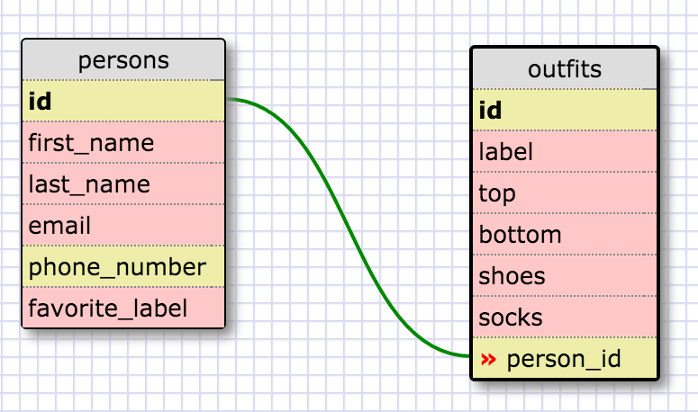

sqlite> SELECT * from states;
sqlite> SELECT * from regions;
sqlite> SELECT state_name, population FROM states;
sqlite> SELECT state_name, population FROM states;
sqlite> SELECT state_name FROM states WHERE region_id = 7;
sqlite> SELECT state_name, population_density FROM states WHERE population_density > 50 ORDER BY population_density ASC;
sqlite> SELECT state_name FROM states WHERE population > 1000000 AND population < 1500000;
sqlite> SELECT region_name FROM regions WHERE region_name LIKE '%Central%';
sqlite> SELECT regions.region_name, states.state_name FROM regions
   ...> INNER JOIN states
   ...> ON states.region_id=regions.id
   ...> ORDER BY states.region_id;

Reflection:

What are databases for?

> Databases are objects that store data in a structured way for the purposes of searching and accessing
  said data in the future.

What is a one-to-many relationship?

> For every row in a parent table, there are zero to multiple rows in the child table.

What is a primary key? What is a foreign key? How can you determine which is which?

> A primary key is a column (or set of columns) that uniquely identifies every record of a table.
  A foreign key of a child table is a primary key of a parent table, used to reference the parent.
  This will be indicated in the schema.

How can you select information out of a SQL database? What are some general guidelines for that?

> SELECT field FROM table 
  Some general guidelines: spell the table and field correctly, end statements with a semi-colon, and
  you have many options as to how the data is displayed to you. 