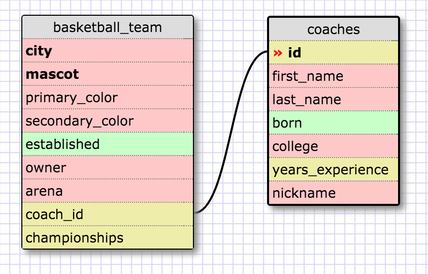
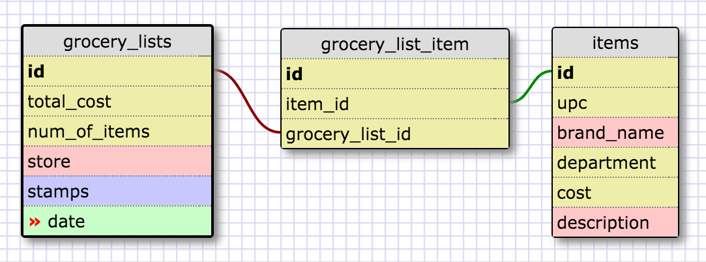

> In this schema, there is a table representing basketball teams and a table representing coaches. A team may only have one head coach and a head coach may only coach one team.

What is a one-to-one database?

> A database where for every row in the parent table there exists at most one row (possibly zero) in the child table.

When would you use a one-to-one database? (Think generally, not in terms of the example you created).

> One would want to use this when there is one row in each table that form a pair.

What is a many-to-many database?

> A database where for every row in the parent table there exist one or many (possibly zero) rows in the child table. The relationship between the two tables is modeled with a join table.

When would you use a many-to-many database? (Think generally, not in terms of the example you created).

> When two tables have fields that can be matched many times over.

What is confusing about database schemas? What makes sense?

> Modeling relationships can be difficult because relationships are more complex than they seem at first. What makes sense is that at their core, databases are just collections of data organized neatly. However, there are many rules to enforce, relationships to model, and normalizations to check for. Although seemingly straightforward, there is much more than meets the eye with databases. Because of this, I believe more studying is warranted here.